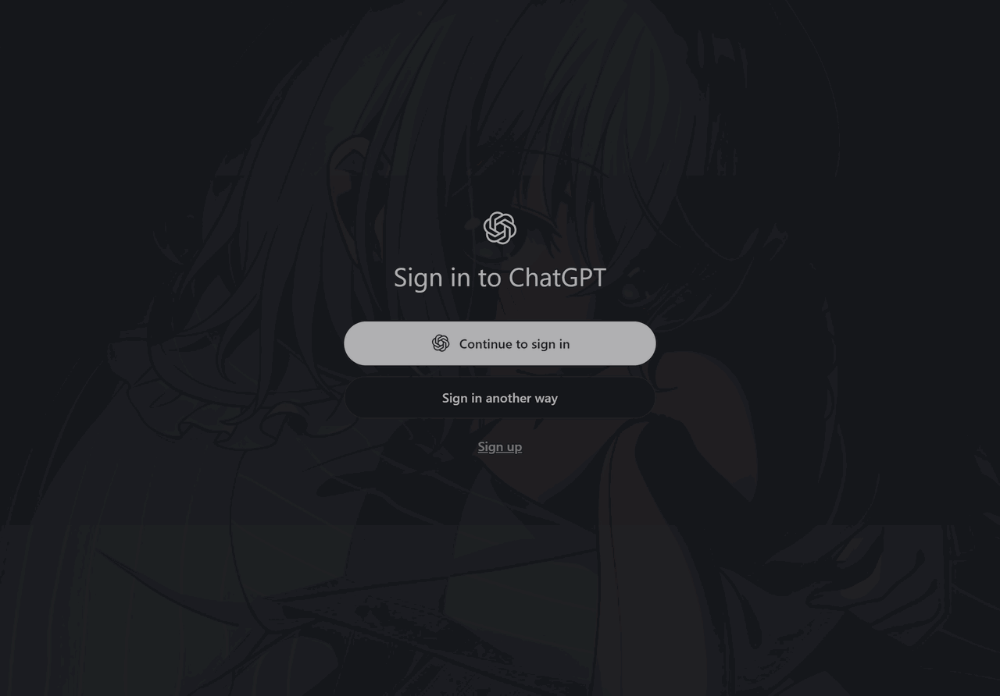

<div align="center">

# Wallvia

**Bring your Wallpaper Engine everywhere.**

把 Wallpaper Engine 的壁纸和毛玻璃界面带到 **VS Code**、**Obsidian** 和 **Codex 桌面版** ——
三个平台，共用一个本机壁纸库。

[](LICENSE)


中文 · [English](README.md)

</div>


<sub>VS Code：壁纸铺满窗口，活动栏与面板透明；右侧的 Wallvia 设置面板里能看到注入状态、本机 Wallpaper Engine 壁纸库（已找到 14 张）和各项效果。</sub>

---

## 目录

- [三个平台](#三个平台)
- [效果](#效果)
- [快速开始](#快速开始)
- [仓库结构](#仓库结构)
- [开发与测试](#开发与测试)
- [许可与致谢](#许可与致谢)

## 三个平台

| 平台 | 怎么装 | 怎么实现 | 文档 |
|:--|:--|:--|:--|
| **VS Code** | 安装 `wallvia-<版本>.vsix` | 生成 CSS 与即时生效脚本，补丁化 `workbench.html` 并同步官方校验和 | [vscode/README.md](vscode/README.zh.md) |
| **Obsidian** | BRAT，或把三个文件放进插件目录 | 官方插件 API + CSS 变量，玻璃层画在 `.workspace-leaf-content::before` | [obsidian/README.md](obsidian/README.zh.md) |
| **Codex 桌面版** | `npm i -g wallvia`，或一键脚本 | CDP 运行时注入，不碰应用文件、不需要管理员 | [codex/README.md](codex/README.md) |

三边共用同一个本机壁纸库（创意工坊 / 自制 / 内置）：都支持 **覆盖 / 填充 / 居中**，VS Code 另有 **包含（contain）**，也都能直接挑一张图片当壁纸。

| 共同点 | 说明 |
|:--|:--|
| 读本机已下载的壁纸 | 不需要 Wallpaper Engine 正在运行，直接扫已下载的壁纸库 |
| 场景包取原图 | 从 `scene.pkg` 的 mipmap 链里取出原始分辨率的 PNG，字节原样，不重编码、不缩放 |
| 视频壁纸抽帧 | 视频壁纸取视频里真实的一帧当静图；三个平台都用宿主自带的 Chromium 离屏解码，不需要 ffmpeg 或任何外部程序 |
| 三种对齐方式 | 覆盖（铺满可裁切）/ 填充（填满可变形）/ 居中（原比例居中） |
| 可读性压暗 | 跟随主题的压暗层，暗色用近黑、亮色用近白，避免压死或过曝 |

## 效果

| VS Code | Obsidian | Codex |
|:--:|:--:|:--:|
|  |  |  |

Obsidian 的浮动面板与壁纸列表：

| 浮动面板 | Wallpaper Engine 壁纸列表 |
|:--:|:--:|
|  |  |

## 快速开始

### VS Code

在 [Releases](https://github.com/Maplelia/Wallvia/releases) 下载 `wallvia-<版本>.vsix` 安装；也可以自己打包：

```powershell
cd vscode
npx --yes @vscode/vsce package
code --install-extension wallvia-*.vsix --force
```

装好后**重载窗口**，命令面板里搜 `wallvia`：`Choose Wallpaper Engine Wallpaper` / `Choose Image File` / `Open Settings Panel`。

### Obsidian

**BRAT**：设置 → BRAT → Add Beta plugin，填 `https://github.com/Maplelia/Wallvia`。

**手动**：把下面三个文件复制到 `<你的 vault>/.obsidian/plugins/wallvia/`：

```text
manifest.json
main.js
styles.css
```

然后重启 Obsidian、关闭受限模式、启用 Wallvia。`main.js` 是构建好的产物，普通安装不需要 Node.js。

> 这三个文件留在**仓库根目录**是刻意的：Obsidian 的自动更新、社区目录校验和 BRAT 都从根目录找它们。源码、文档和截图收在 [`obsidian/`](obsidian/)。

### Codex 桌面版

```powershell
npm i -g wallvia
wallvia watch          # 跟随 Wallpaper Engine 当前壁纸
wallvia list           # 列出本机已下载的壁纸
wallvia stop           # 恢复原状
```

不想经过 npm，就用一键脚本装到 `%LOCALAPPDATA%\Wallvia`：

```powershell
irm https://cdn.jsdelivr.net/gh/Maplelia/Wallvia@main/codex/install.ps1 | iex
```

## 仓库结构

```text
.
├── manifest.json / main.js / styles.css / versions.json   Obsidian 交付文件（必须在根目录）
├── obsidian/      Obsidian 插件源码、文档与截图
├── vscode/        VS Code 扩展（src/、images/、scripts/）
├── codex/         Codex CLI 与 CDP 注入器
├── tests/         测试套件（含 mock，零依赖）
├── scripts/       版本号等维护脚本
├── INSTALL.md     安装说明
└── CREDITS.md     致谢与第三方来源
```

## 开发与测试

环境要求：**Node.js 22 或更高**（Codex 侧用到全局 `WebSocket`）。

工具链装在仓库根目录，三个平台和测试共用同一份 `node_modules`：

```powershell
npm install          # 只需一次
npm run build        # Obsidian：类型检查 + esbuild 打包到根目录 main.js
npm run dev          # Obsidian：监听改动
npm test             # 全部测试（零依赖，直接跑 Node）
npm run lint         # ESLint + Stylelint
```

当前回归结果：

```text
ALL TESTS PASSED
```

测试覆盖：配置校验、共享核心参数、壁纸发现与排序、`scene.pkg` 原图提取（含 mipmap 分级与缓存）、MP4 容器解析、视频抽帧缓存、Obsidian 插件生命周期与样式不变量、VS Code 补丁与还原、VS Code 真实样式表权重守卫，以及真实 Chromium 的 CDP 注入。

## 许可与致谢

Wallvia 使用 [MIT License](LICENSE)。

Wallpaper Engine 是 Kristjan Skutta 的产品，Wallvia 与其没有隶属关系；本项目只读取它在本机的配置文件与壁纸目录。玻璃壁纸的思路来自 DSH 生态中的壁纸插件，具体来源见 [CREDITS.md](CREDITS.md)。
