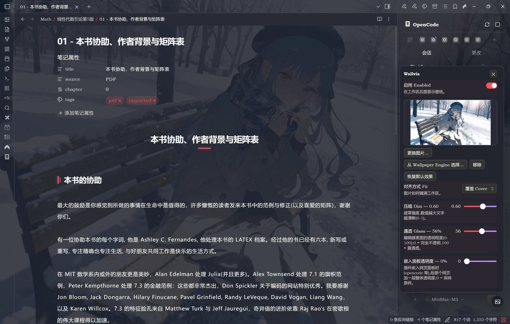
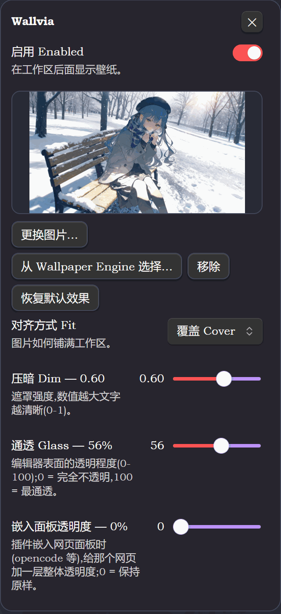
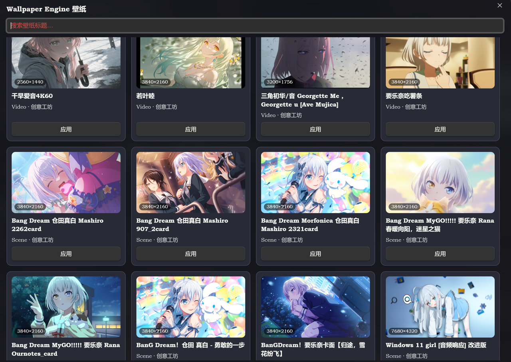

<div align="center">

# Wallvia for Obsidian

**Bring your Wallpaper Engine everywhere.**

Turn an image from your vault, or a wallpaper Wallpaper Engine has already downloaded, into the Obsidian workspace background —
the editor, the sidebars and embedded web pages all become glass, on dark and light themes alike.

[](../LICENSE)


English · [中文](README.zh.md)

</div>



<sub>The wallpaper shows through behind the editor, the left and right sidebars and the tab area are glass, and the body text stays perfectly legible.</sub>

| Item | Detail |
|:--|:--|
| Plugin ID | `wallvia` |
| Current version | `1.0.0` |
| Minimum version | Obsidian `1.4.0` |
| Wallpaper Engine | Windows desktop |
| Source location | `obsidian/` in the repository root |

---

## Contents

- [Features](#features)
- [Installation](#installation)
- [Usage](#usage)
- [Wallpaper Engine wallpaper list](#wallpaper-engine-wallpaper-list)
- [Video wallpapers](#video-wallpapers)
- [Effects](#effects)
- [Settings](#settings)
- [FAQ](#faq)
- [Uninstall and restore](#uninstall-and-restore)
- [Known limitations](#known-limitations)
- [Development and tests](#development-and-tests)
- [License](#license)

---

## Features

| | Feature |
|:--|:--|
| 🖼️ | Pick an image from your vault, or choose one of the wallpapers Wallpaper Engine has already downloaded |
| 🧩 | The wallpaper list reflows into columns to fit the window width, with search, arrow-key selection and a native-resolution badge |
| 🪟 | Glass on the editor, both sidebars and the web panels a plugin embeds |
| 🌗 | Adapts to dark / light themes automatically |
| 🎛️ | Adjustable Fit, Dim, Glass, Blur, image opacity, embed opacity and dim colour |

---

## Installation

### BRAT

1. Install [BRAT](https://github.com/TfTHacker/obsidian42-brat);
2. **Settings → BRAT → Add Beta plugin**, and enter:

   ```text
   https://github.com/Maplelia/Wallvia
   ```

3. Enable Wallvia under **Settings → Community plugins**.

### Manual installation

Copy these three files into `<your vault>/.obsidian/plugins/wallvia/`:

```text
manifest.json
main.js
styles.css
```

Restart Obsidian, turn off Restricted mode and enable the plugin. `main.js` is already built, so a normal install needs no Node.js.

### Building from source

```powershell
npm install
npm run build     # type check + esbuild bundle; the artifact lands in main.js at the repository root
npm run dev       # watch for changes
```

---

## Usage

| Command | What it does |
|:--|:--|
| `Open wallpaper panel` | Opens the floating panel (same as the ribbon icon) |
| `Pick wallpaper image` | Picks an image from your vault |
| `Choose from Wallpaper Engine` | Opens the Wallpaper Engine wallpaper list |
| `Toggle wallpaper` | Quickly turns the background on / off |

The floating panel adjusts **Fit, Dim, Glass, embed opacity, Blur and image opacity**; the dim colour lives on the settings page (the panel has no room for it).



<sub>The floating panel: Fit, Dim, Glass, embed opacity, Blur and image opacity, all in one place.</sub>

---

## Wallpaper Engine wallpaper list



<sub>The wallpaper list: a 16:9 preview box, the native-resolution badge in the bottom-left corner, the type and source, and a badge for the one currently in use.</sub>

Every card carries a 16:9 preview box (the image shown in full, never cropped), a **native-resolution** badge in the bottom-left corner, the title, a type and source such as `Scene · Workshop`, and an Apply button; the one currently in use has a "Current" badge in its top-right corner.

| Action | Effect |
|:--|:--|
| Search box | Filters instantly by title / type / source |
| Arrow keys | Move the selection (up / down move a whole row) |
| `Enter` | Applies the selected wallpaper |
| `Esc` | Closes the list |
| Click a card | Selects it; it only takes effect when you click Apply or press `Enter` |

### Where the thumbnails come from

Wallpaper Engine's own `preview.jpg` is **square** (801×801 and 192×192 measured on this machine), so squeezing it into a 16:9 box always leaves the background colour showing at the sides. Thumbnails are therefore taken in the order below, with the same rules as the VS Code version:

| Priority | Source | Detail |
|:--:|:--|:--|
| 1 | The `scene.pkg` mipmap chain | A `.tex` carries the whole mipmap chain; takes a level about 480px wide, **without rescaling** |
| 2 | Loose images in the project folder | Built-in wallpapers are unpacked projects; scans `materials/`, `images/`, `img/`, `textures/`, `pictures/`; scored by how close to 16:9 they are, and anything squarer than 1.2:1 is dropped outright |
| 3 | A video frame | A video wallpaper has no still image, so a frame is taken with the host Chromium (see below) |
| 4 | `preview.jpg` | The fallback: square, with the box's background colour `#0b0d12` showing at the sides |

> **What gets applied is always the full native artwork**; the 16:9 box only affects the card thumbnail.

### Native-resolution badge

The badge reports the size of **the image that will fill the workspace once applied**, not the size of the thumbnail:

| Type | Badge |
|:--|:--|
| Scene wallpaper | The size of the largest embedded PNG in `scene.pkg` (3840×2160 and 7680×4320 measured on this machine) |
| Video wallpaper | The real frame size in the MP4 container (3830×2160 and 3840×2160 measured on this machine) |
| A wallpaper with no larger asset | Not shown |

When the long edge is under 1280 the badge turns red, warning that it will look soft filling the window.

### Disk reads and caching

- Card images are read through Node and handed to the renderer as `blob:` URLs (`file://` is rejected by Obsidian), and released one by one when the window closes;
- Opening the list reads the first screenful first and the rest follows the scroll position, so a library of several hundred is not read off disk the moment it opens;
- Disk reads run serially, one package parsed at a time;
- Results are cached in memory per project folder, so each wallpaper is parsed once.

---

## Video wallpapers

The background layer is a CSS `background-image`, which cannot hold a video, so a video wallpaper is **a single still frame** too — but that frame is **a real frame from the video**, not the 192×192 square preview.

Decoding is done by the host's own Chromium: a hidden `<video>` attached to the document loads the `app://` asset URL, seeks to the 2-second mark, and the result is drawn to a canvas and exported as JPEG.

> **No ffmpeg is needed**, nor any extra dependency or external program.

Decoded frames are cached in the system temporary directory `wallvia-stills/` under the key `path + file size + modification time + width cap` (70–120 KB each), so the second open is instant; the cache key is invalidated automatically once a Workshop item is updated.

---

## Effects

### Dim layer colour (Wash)

The readability dim laid over the wallpaper follows the theme by default:

| Theme | Colour |
|:--|:--|
| Dark | `rgb(8 10 18)` |
| Light | `rgb(246 247 250)` |

Not pure black / pure white, so that nothing ends up crushed or blown out. The `Wash` setting can be changed to **dark / light / a custom colour**; touching the colour picker switches it to custom mode automatically.

### Fit

| Mode | Detail |
|:--|:--|
| `cover` | Keeps the aspect ratio and fills, possibly cropping the edges |
| `fill` | Forces a fill, possibly distorting the image |
| `center` | Keeps the native ratio and centres, no cropping, possibly leaving margins |

The preview box in the wallpaper list always shows the image in full and is unaffected by this Fit.

### Transparent iframe

Obsidian cannot change the CSS inside a cross-origin iframe directly, so Wallvia composites elements instead:

- The glass layer is painted on `.workspace-leaf-content::before`;
- Panes that contain an iframe relax Obsidian's containment;
- `lighten` on dark themes, `darken` on light ones;
- iframes in note bodies keep rendering normally.

So a workspace web page such as OpenCode can show the wallpaper through, while its text and controls stay intact.

---

## Settings

| Setting | Range | Default |
|:--|:--|--:|
| Enabled | On / off | On |
| Fit | `cover` / `fill` / `center` | `cover` |
| Dim | `0`–`1` | `0.35` |
| Glass | `0`–`100` | `55` |
| Blur | `0`–`40` px | `10` |
| Embed opacity | `0`–`100` | `0` |
| Image opacity | `0`–`1` | `0.6` |
| Wash | `auto` / `dark` / `light` / custom | `auto` |
| Native artwork from scene packages | On / off | On |
| Video frame extraction | On / off | On |
| Max source width | `0`–`7680`, step `160` | `0` |
| Cache directory | Vault path | `Wallpapers` |

**Restore default effects** puts Fit, Dim, Glass, Blur, image opacity, embed opacity and Wash back to their defaults, but keeps the current wallpaper, the cache directory and the three **optional behaviour** switches below — they are not effects, and quietly turning 4K native artwork back on would be surprising.

### Optional behaviour

#### Native artwork from scene packages · on by default

Pulls the embedded PNG out of the `scene.pkg` mipmap chain and copies the bytes verbatim; built-in projects with no package are scanned folder by folder instead. Turning it off makes both the cards and the background fall back to the square `preview.*` — softer, but **never blank**.

#### Video frame extraction · on by default

Uses a real frame from the video as the thumbnail. Turning it off falls back to the square preview image; frames already cached are not deleted.

> **Consistent across platforms**
> All three platforms take the same path: an offscreen decode in the host's own Chromium to grab a frame,
> **with no `ffmpeg` and no external program or dependency**.

#### Max source width · default `0`

The width cap applied when the native artwork is taken, to hold down the VRAM footprint of 4K images (about 33 MB once 3840×2160 is decoded).

| Value | Behaviour |
|--:|:--|
| `0` | Uses the sharpest level |
| `1920` | Uses **the smallest level in the mipmap chain that is not below 1920**; if there is none, the largest level |

It **only picks a level and never rescales**: the bytes copied into the vault are always the level exactly as Wallpaper Engine has it. The value constrains the card thumbnails, the background native artwork and the video frame width at once, and it is part of the cache key (`0` and `1920` are stored separately and never mix).

Measured on the same 7680×4320 wallpaper:

| Setting | Size on disk |
|--:|:--|
| `1920` | 1920×1080 |
| `0` | 7680×4320 |

### Switches deliberately left out

| Switch | Why it is not there |
|:--|:--|
| Live apply | Not a problem on the Obsidian side. The plugin writes values straight into CSS variables, so a change applies live; making it a switch would only be a fake switch that is always true |
| Follow the theme's light or dark | `Wash` already covers it, and with two more steps than the VS Code version: it can pin dark / light and take a custom colour as well |

---

## FAQ

**A card has dark bands at the sides**

This one fell back to the square `preview.jpg`: either it is a video wallpaper with video frame extraction turned off, or the textures in the package are DXT-compressed, with no PNG anywhere in the package and no landscape asset in the folder either. What shows at the sides is the preview box's background colour; the image itself has not been cropped or stretched.

**Only some cards have an image when the list opens**

That is lazy loading: it reads as far as you scroll. Scroll down and the rest arrive; cards that have not been read yet show no error.

**The badge is missing or has turned red**

- Missing: this wallpaper has no asset larger than the thumbnail, so there is no native artwork to label.
- Red: the native artwork's long edge is under 1280, so it will look soft filling the window.

**The badge takes a moment to appear**

Parsing and the thumbnail share one trigger and only start once a card scrolls into view. A scene wallpaper has to read the whole `scene.pkg` (7–10 MB each on this machine), while a video wallpaper reads only the file header; disk reads are serial, so one pass down the list fills everything in.

**The background still looks blurry**

Check the badge first: if it has turned red, the largest image available is itself small. A video wallpaper can only use a single still frame, and CSS cannot recover detail from a low-resolution source; for a scene wallpaper, try putting max source width back to `0`.

**Wallpaper Engine cannot be found**

The picker supports Windows and Steam installs. Make sure Steam or Wallpaper Engine is running and that the project folder holds a `project.json` and a usable preview file.

## Uninstall and restore

**Uninstall**: Settings → Community plugins — turn Wallvia off (or delete it), then remove `<your vault>/.obsidian/plugins/wallvia/`; if you installed it through BRAT, remove the beta plugin there instead.

Restoration happens the moment the plugin is switched off: the injected style classes and CSS variables are all cleaned up in `onunload()`, Obsidian does not need a restart, and your notes, themes and CSS snippets have never been modified.

**What it leaves behind**:

| Location | Content | What to do |
|:--|:--|:--|
| `<vault>/.obsidian/plugins/wallvia/data.json` | Your settings | Delete it for a factory reset |
| `<vault>/<cache directory>/` | The preview images copied from Wallpaper Engine, in `Wallpapers/` by default | Delete the whole directory when you no longer need it |

Every file in the cache directory carries the plugin's own prefix, and **only one is kept at a time** — changing wallpaper deletes the previous preview it had copied. So even if you never clean up after uninstalling, at most one image is left; the plugin **never** touches your own files.

## Known limitations

- **The Wallpaper Engine picker is desktop only**: that code is guarded by `Platform.isDesktop`, so in the mobile build it is entirely inert and loads no Node module. The plugin itself still works on mobile, except that it can only pick images from the vault.
- **Animated content does not play**: Obsidian can only paint a static background — a scene wallpaper takes the original image inside the package and a video wallpaper a single still frame, and neither of them plays.
- **Built-in / web projects have no `scene.pkg`**: only the loose images in the project folder can be scanned, and if none can be used it falls back to the square `preview.*`; DXT-compressed textures cannot be decoded either, so they fall back to the square preview as well, with the preview box's background colour showing at the sides of the image.
- **Disk reads on the first screen**: a scene wallpaper has to read the whole `scene.pkg` (7–10 MB each on this machine), parsing only starts once a card enters the viewport, and disk reads are serial; after one pass down the list everything comes from the cache.
- **Transparency for embedded web pages relies on "Transparent iframe"**: the glass layer is painted on `.workspace-leaf-content::before`, while the webview's own base colour is decided inside it, so the plugin can only accommodate it as far as it can.
- **How the settings tab renders depends on the Obsidian version**: 1.13 and above use the official declarative settings, which settings search can find; 1.4–1.12 use the legacy `display()` rendering — the same features, but search cannot find them.
- **Obsidian 1.4.0 is the minimum requirement**, and the Wallpaper Engine wallpaper library needs the Windows desktop app; if you only use images from your vault as wallpapers, either platform works.

---

## Development and tests

Everything for the plugin lives in `obsidian/`: source, docs, screenshots, `tsconfig.json` and `eslint.config.mjs`. As Obsidian requires, the build artifact lands in `main.js` at the **repository root**.

The toolchain is installed at the repository root (the VS Code extension, the CLI and the test suite share that one `node_modules`), so run these from the root:

```powershell
npm install                                    # once
npm run build                                  # type check + bundle
npm run dev                                    # watch for changes
npm test                                       # the whole suite
npm run lint                                   # ESLint + Stylelint
```

Current regression result:

```text
ALL TESTS PASSED
```

---

## License

Wallvia is released under the MIT License; see [LICENSE](../LICENSE). Wallpaper Engine is a product of Kristjan Skutta, and Wallvia is not affiliated with it.
