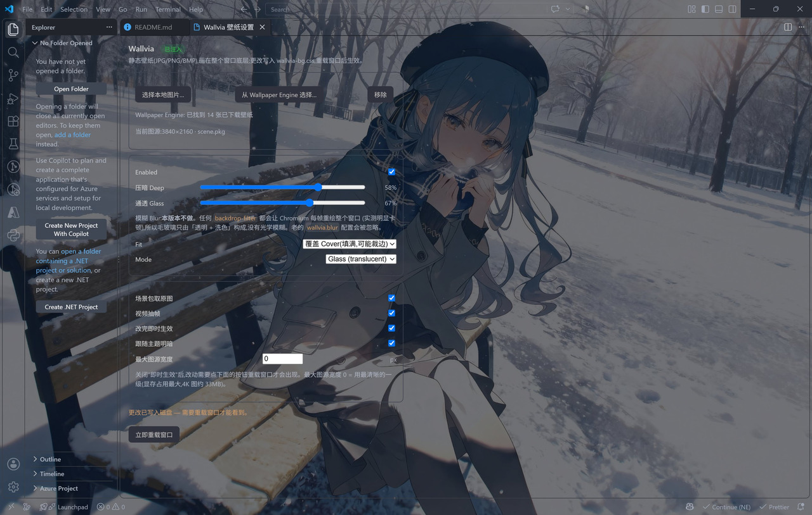
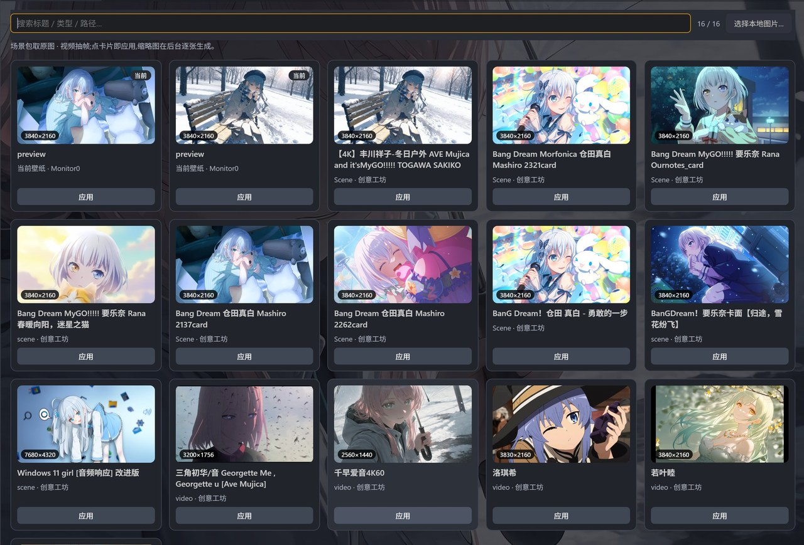
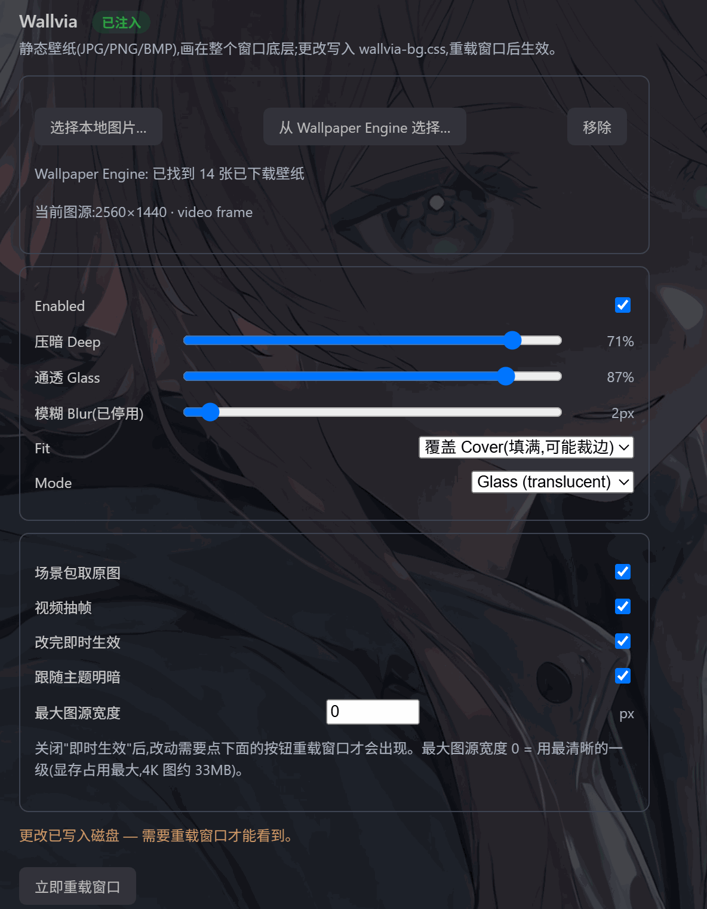
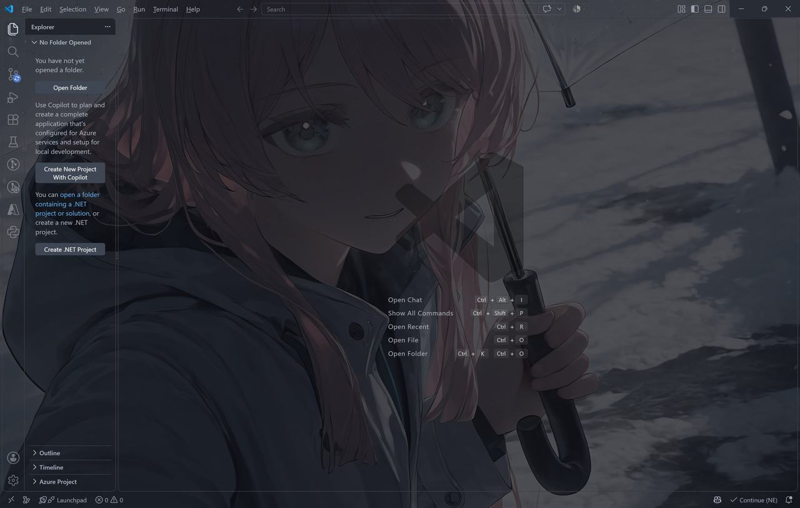

<div align="center">

# Wallvia for VS Code

**Bring your Wallpaper Engine everywhere.**

选一张图片当作整个 workbench 的背景，编辑区与面板变成半透明毛玻璃，文字依然清晰。

[](LICENSE)


中文 · [English](README.md)

</div>



<sub>VS Code 实测：壁纸铺满窗口，活动栏 / 标题栏 / 状态栏透明，编辑器半透明；右侧是 Wallvia 设置面板（注入状态、本机壁纸库、效果滑杆与开关）。</sub>

---

## 目录

- [特性](#特性)
- [系统要求](#系统要求)
- [安装](#安装)
- [使用](#使用)
- [设置参考](#设置参考)
- [工作原理](#工作原理)
- [卸载与还原](#卸载与还原)
- [验证](#验证)
- [已知限制](#已知限制)
- [目录结构](#目录结构)
- [致谢](#致谢)

## 特性

| 特性 | 说明 |
|:--|:--|
| **直接选 Wallpaper Engine 壁纸** | 卡片网格列出本机**已下载**的壁纸（创意工坊 + 我的项目 + 内置），16:9 大图 + **分辨率角标** + 搜索框，正在使用的那张标「当前」 |
| **原图优先，不是方图预览** | 场景壁纸从 `scene.pkg` 的 mipmap 链取真实画面（实测 3840×2160 / 7680×4320），不用 801–1024 的方形预览图；内置 / web 项目扫描 `materials/`、`images/` 里的宽图 |
| **视频壁纸也有一帧真画面** | 由编辑器自带的 Chromium 解码（离屏 `<video>` + canvas），**不装 ffmpeg、不加任何依赖** |
| **四种对齐** | **覆盖 cover** / **包含 contain**（整图不裁剪，留边）/ **填充 fill** / **居中 center** |
| **压暗层** | `dim` 保证花哨壁纸上的文字依然清晰，并可**跟随主题明暗**（暗色用近黑、亮色用近白） |
| **通透度** | `glass` 0-100：100 = 编辑器几乎完全透出壁纸，0 = 接近不透明。侧栏与面板始终透明，可读性由 `dim` 保证 |
| **即时生效** | 改设置 / 换壁纸不重载窗口：注入的小脚本轮询一个 stamp 文件并**就地替换样式表**（可关） |
| **图形设置面板** | 滑杆 + 开关 + 实时状态（补丁是否已注入、已找到多少张壁纸、当前图源的分辨率与来源） |
| **更新自动重打** | VS Code 升级会清掉补丁，扩展启动时检测版本并自动重写 |
| **幂等 + 备份 + 一键还原** | 只动自己带标记的代码块，原文件留备份，一条命令还原安装目录 |

## 系统要求

| 项目 | 要求 |
|:--|:--|
| VS Code | **1.80+**（桌面版） |
| 安装目录 | 对 VS Code **安装目录**有写权限，是否需要管理员见下表 |
| 外部程序 | 不需要任何外部程序：没有 ffmpeg、没有 npm 依赖、没有构建步骤 |

| 安装位置 | 需要管理员？ |
|:--|:--|
| `%LOCALAPPDATA%\Programs\Microsoft VS Code`（用户级安装） | 否 |
| 非 Program Files 的自定义目录（如 `D:\Microsoft VS Code`） | 否（实测可写） |
| `C:\Program Files\...` | 通常需要 |

> ⚠️ **仅本机桌面版有效。** 本扩展通过修改安装目录的 `workbench.html` 实现背景图，
> 所以在 vscode.dev / 网页版 / Remote-SSH / Dev Containers 里装上也不会生效。

## 安装

| 方式 | 入口 | 适合 |
|:--|:--|:--|
| **A** | 一行下载并安装 | 最省事，三行都自动取最新版 |
| **B** | 已克隆仓库时直接装本地包 | 手里已经有 `.vsix` |
| **C** | 从源码打包 | 自己构建安装包 |
| **D** | 开发模式调试 | 改代码，按 <kbd>F5</kbd> 起调试宿主 |
| **E** | 手动放入扩展目录 | 不经过命令行 |

### 方式 A：一行下载并安装（最省事）

```powershell
$r = irm https://api.github.com/repos/Maplelia/Wallvia/releases/latest
$u = ($r.assets | Where-Object name -like '*.vsix').browser_download_url
irm $u -OutFile "$env:TEMP\wallvia.vsix"; code --install-extension "$env:TEMP\wallvia.vsix"
```

三行都自动取**最新版**（不写死版本号，以后发版也不会 404）。想锁定版本就直接指定，例如：
`https://github.com/Maplelia/Wallvia/releases/download/v<version>/wallvia-<version>.vsix`

### 方式 B：已克隆仓库时直接装本地包

```powershell
code --install-extension (Get-ChildItem *.vsix | Select-Object -Last 1).FullName
```

### 方式 C：从源码打包

```powershell
npx @vscode/vsce package --allow-missing-repository
code --install-extension .\wallvia-<版本>.vsix   # 版本号见 package.json
```

### 方式 D：开发模式调试

本目录带 `.vscode/launch.json`，直接在 VS Code 里按 <kbd>F5</kbd>。

### 方式 E：手动放入扩展目录

把本目录复制到 `%USERPROFILE%\.vscode\extensions\wallvia.wallvia-<版本>\` 后重启。

> 装完**重载一次窗口**（命令面板 → `Developer: Reload Window`）：扩展首次激活会写好补丁，
> 而 `workbench.html` 只在窗口启动时读取一次。

## 使用

命令面板（<kbd>Ctrl</kbd>+<kbd>Shift</kbd>+<kbd>P</kbd>）输入 **`wallvia`** —— 所有命令统一以 `Wallvia:` 开头，所以搜品牌名必然命中；搜 `wallpaper engine` 也能找到选择器那条。

| 命令 | 作用 |
|:--|:--|
| **Wallvia: Choose Wallpaper Engine Wallpaper…** | 打开卡片网格选择器（**首选**） |
| **Wallvia: Choose Image File…** | 选本地静态图（JPG / PNG / BMP）并应用 |
| **Wallvia: Open Settings Panel** | 图形面板：效果滑杆 + 四个可选开关 + 图源宽度上限 |
| **Wallvia: Toggle Glass Effect** | `glass` ↔ `fade` 切换 |
| **Wallvia: Remove Wallpaper** | 移除壁纸（并删除已拷贝的图片） |
| **Wallvia: Show Status** | 输出状态 JSON（排障用，含当前图源与分辨率） |
| **Wallvia: Restore Original workbench.html** | 从备份还原安装目录，删掉生成的 CSS / 脚本 / stamp |

> 历史提示：0.1.x 里命令叫 `Wallpaper: Pick Image…` 等，且挂在 `Glass Wallpaper` 分类下；
> 0.2.0 起统一为 `Wallvia:` 前缀。

### Wallpaper Engine 壁纸选择器



<sub>Wallpaper Engine 选择器：卡片网格 + 分辨率角标（截图里 3840×2160 的场景、3200×1756 / 2560×1440 / 3830×2160 的视频帧），「当前」是正在生效的那张，点卡片即应用。</sub>

## 设置参考

| 设置项 | 取值 | 默认 | 说明 |
|:--|:--|:--|:--|
| `wallvia.enabled` | boolean | `true` | 是否启用壁纸 |
| `wallvia.dim` | 0-80 | `45` | 压暗层强度（%）。亮图建议 40-60 |
| `wallvia.glass` | 0-100 | `55` | 通透度（%）。100 时编辑器底色最淡，0 时接近不透明 |
| `wallvia.mode` | `glass` \| `fade` | `glass` | `fade` 只保留一层更淡的洗色，最稳 |
| `wallvia.fit` | `cover` \| `contain` \| `fill` \| `center` | `cover` | **覆盖**填满（可能裁边）/ **包含**整图不裁剪（留深色边）/ **填充**拉伸 / **居中**原始大小 |
| `wallvia.hires` | boolean | `true` | 场景包取原始分辨率大图；关掉则只用 801–1024 的预览图 |
| `wallvia.videoFrames` | boolean | `true` | 视频壁纸抽一帧当缩略图 / 背景（Chromium 解码，无需 ffmpeg） |
| `wallvia.liveApply` | boolean | `true` | 改动即时生效；关掉后改动需手动重载窗口 |
| `wallvia.themeAware` | boolean | `true` | 压暗层颜色跟随主题明暗 |
| `wallvia.maxImageWidth` | 0-7680 | `0` | 图源宽度上限。`0` = 场景取最清晰一级、视频卡片帧 960；设 1920/2560 可显著降低显存与解码开销，设大值则让视频卡片帧一起变清晰 |
| `wallvia.autoReapply` | boolean | `true` | VS Code 更新后自动重打补丁 |
| `wallvia.blur` | 0-12 | `0` | **已停用**（保留键只为让老配置不报错）：任何 `backdrop-filter` 都会让 Chromium 每帧重绘整个窗口，内部固定按 0 处理 |

### 图形设置面板



<sub>设置面板：左上角徽标显示补丁是否已注入，并列出检测到的 Wallpaper Engine 壁纸数量与**当前图源**（分辨率 + 来源）；下半部分是可选的四个开关与图源宽度上限。</sub>

## 工作原理

VS Code **没有任何官方 API** 能设置整个 workbench 的背景图
（[#134317](https://github.com/microsoft/vscode/issues/134317)、
[#6007](https://github.com/microsoft/vscode/issues/6007) 多年未实现），
社区所有背景类扩展走的都是「改安装目录文件」这条路。本扩展的做法：

1. 图片拷入扩展 `globalStorage`（**保留真实扩展名**，避免 mime 与内容不符）；
2. 在 `workbench.html` 同目录生成 `wallvia-bg.css`（必要时还有 `wallvia-live.js` 与 `wallvia-stamp.txt`）；
3. 往 `<head>` 注入一段带标记的 `<link>`（幂等，只动自己的标记块）；
4. 同步 `product.json` 的 `checksums`，避免「安装已损坏」警告；
5. 原文件备份为 `workbench.html.wallvia.bak`。

### 渲染模型：一层壁纸 + 一层洗色 + 透明表面

```css
html body::before  { position:fixed; inset:0; z-index:0; background-image:url(壁纸) }  /* 唯一的壁纸层 */
html body::after   { position:fixed; inset:0; z-index:1; background:rgba(8,10,18,dim) } /* 唯一的压暗层 */
html body .monaco-workbench { position:relative; z-index:2; background:transparent }     /* 表面全部透明 */
```

壁纸**绝不**画在侧栏 / 面板各自的 `background-image` 上：那样每个表面各画一遍，
既重复解码又会在窗口改变大小时出现接缝（早期版本就是这么做的，已废弃）。



<sub>侧栏、编辑器、终端面板同时打开时，壁纸在四个区域是**连续**的 —— 侧栏不是一块不透明卡片。</sub>

### 三个必须踩对的细节（全部在真实 workbench 里实测过）

| 细节 | 做错的后果 |
|:--|:--|
| `checksums` 必须是 **sha256 的 base64、去掉 `=` 填充**（43 字符） | 写成 hex → 每次启动弹 *"Your Code installation appears to be corrupt"* |
| 图片 URI 必须**百分号编码**，用 `vscode.Uri.file(p).with({scheme:'vscode-file',authority:'vscode-app'})` | 路径含空格或中文时（Windows 极常见）渲染器拒绝加载 |
| 壁纸层的 `z-index` 用 **0 / 1 / 2 正层**，不要用负值 | 负 `z-index` 会被 `.monaco-workbench` 自己的层叠上下文剪掉 → **壁纸完全不显示** |

### 两套「清底」机制（缺一不可）

workbench 里的表面用两种方式被画上颜色，必须分别对付：

1. **`!important` 的选择器** —— 用一条更具体、同样 `!important` 的规则压过去。
   一定要照抄 VS Code 真实的类链，例如现代 UI（1.140+）的浮动卡片：

   ```css
   .monaco-workbench.floating-panels .part.sidebar { background-color: var(--vscode-surface-background) !important }
   ```

   这是 **(0,4,0)** 权重。写成 `html body .monaco-workbench .part.sidebar` 只有 (0,3,2)，
   **会输** —— 现象就是「壁纸铺满整窗，但侧栏还是一块不透明卡片」。

2. **主题变量** —— 大量表面是通过主题变量上色的（`--vscode-tab-inactiveBackground` 之类），
   把这些变量在 `.monaco-workbench` 上置为 `transparent`，就无需逐个表面写规则：

   ```css
   html body .monaco-workbench { --vscode-editor-background: transparent; --vscode-sideBar-background: transparent;
                                 --vscode-surface-background: transparent; --modern-ui-shell-background: transparent; … }
   ```

`tests/vscode-css-weight.cjs` 会把**真实安装目录里的 `workbench.desktop.main.css`** 解析出来，
逐条检查「每条给结构表面上色的规则」是否都被上面两套机制之一盖住，所以 VS Code 换版本、改类名时会
立刻报警，而不是等你发现侧栏又变不透明了。

### 即时生效（不重载窗口）

`workbench.html` 只在窗口启动时读一次，所以早期版本每次改设置都要重载整个窗口。现在
`applyPatch()` 会额外写：

- `wallvia-live.js` —— 一段小脚本，每 2 秒 `fetch('./wallvia-stamp.txt')`；
- `wallvia-stamp.txt` —— CSS 的 mtime 戳。

stamp 变了就**就地改写 `<link href>`**，浏览器重新读取样式表，窗口其余部分完全不动。
（workbench 的 CSP 有 `require-trusted-types-for 'script'`，所以不能用动态插 `<script>` 的方式，
只能 `fetch` + 改 `href`；`connect-src 'self'` 允许这个 fetch。）

## 卸载与还原

一条命令即可：

```
Wallvia: Restore Original workbench.html
```

它会把备份覆盖回去，删除 `wallvia-bg.css`、`wallvia-live.js`、`wallvia-stamp.txt`，并重算
`product.json` → `checksums`。

手工步骤（等价）：

1. 用 `workbench.html.wallvia.bak` 覆盖 `workbench.html`；
2. 删除 `<!-- wallvia:start -->` … `<!-- wallvia:end -->` 标记块；
3. 删除同目录的 `wallvia-bg.css` / `wallvia-live.js` / `wallvia-stamp.txt`；
4. 重算 `product.json` → `checksums["vs/code/electron-browser/workbench/workbench.html"]`；
5. 卸载扩展（缓存目录 `globalStorage/wallvia.wallvia/` 与 `%TEMP%\wallvia-stills\` 可一并删除）。

## 验证

```powershell
node tests/run-all.cjs             # 全套（从仓库根目录跑）
node tests/vscode-smoke.cjs        # VS Code 扩展：注入 / 校验和 / 选择器 / 视频帧往返（假安装目录）
node tests/vscode-video-frame.cjs  # 帧缓存、宽度策略、坏载荷拒收
node tests/vscode-video-decode.cjs # 真 Chromium + 真视频：抽帧函数本身（无浏览器则 SKIP）
node tests/vscode-css-weight.cjs   # 用真实 VS Code 样式表校验清底权重（没装 VS Code 则 SKIP）
```

| 命令 | 覆盖范围 |
|:--|:--|
| `node tests/run-all.cjs` | 全套，从仓库根目录跑 |
| `node tests/vscode-smoke.cjs` | 注入 / 校验和 / 选择器 / 视频帧往返（假安装目录） |
| `node tests/vscode-video-frame.cjs` | 帧缓存、宽度策略、坏载荷拒收 |
| `node tests/vscode-video-decode.cjs` | 真 Chromium + 真视频：抽帧函数本身（无浏览器则 SKIP） |
| `node tests/vscode-css-weight.cjs` | 用真实 VS Code 样式表校验清底权重（没装 VS Code 则 SKIP） |

## 已知限制

- 仅桌面版；Remote / Web 不适用。
- **Wallpaper Engine 选择器仅 Windows 桌面端**：定位方式为 运行中的 WE 进程 → Steam 注册表 →
  常见安装目录（也可用环境变量 `WE_CONFIG` 指向 `config.json` 强制指定）。
- **动态内容不会动**：VS Code 只能画静态背景。场景壁纸取包内原始画面，视频壁纸取一帧，
  内置默认项目的 DXT/TGA 贴图无法解码，只能用 WE 自带的方形预览图。
- 未安装 WE 时该命令会明确提示，可继续用「选择本地图片文件」。
- VS Code 更新会覆盖补丁，依赖扩展启动时的自动重打。
- **编辑器区域的不透明度由 `glass` 决定**：Monaco 把 `--vscode-editor-background` 同时画在
  `.monaco-editor` 和 `.monaco-editor-background` 两层上，两层都要处理，否则一打开文件编辑器就是
  一块纯黑（空编辑器看不出问题，因为那时 Monaco 根本没画控件）。想更清楚地看到壁纸，把
  `wallvia.glass` 调到 100。
- `glass` 模式依赖 `.part.*` 等 DOM 结构，大版本更新后个别选择器可能失效，此时切 `fade`
  （或跑权重测试定位）。1.140 的「浮动卡片」现代 UI 已专门适配。
- **不做光学模糊**：任何 `backdrop-filter` 都会让 Chromium 每帧重绘整个窗口，代价远大于收益，
  所以毛玻璃只由「透明 + 洗色」构成，`wallvia.blur` 保留但固定不生效。
- 4K 图源解码后约占 33MB 显存；在意的话用 `wallvia.maxImageWidth` 限制到 1920/2560。
- 修改安装目录本质上是 hack，请自行评估风险；本扩展只做最小改动并保留备份。

## 目录结构

```
.
├── package.json             # 命令与设置声明
├── src/extension.js         # 扩展主体：打补丁 / 生成 CSS / 选择器与设置面板（纯 CJS，无需构建）
├── src/wallpaper-engine.js  # Wallpaper Engine 定位 + 已下载壁纸枚举
├── src/still-image.js       # 从 scene.pkg 的 .tex / 项目散图里取出最合适的静图
├── src/video-frame.js       # 视频帧缓存：键、宽度策略、坏载荷校验（与 Obsidian 共用同一目录）
├── src/mp4.js               # 纯字节解析 MP4 的 tkhd，取视频自身分辨率
├── scripts/verify.js        # 发布前一致性检查（vsce 的 prepublish 会调用）
├── images/                  # README 截图
├── LICENSE
├── README.md              # 英文(默认)
└── README.zh.md           # 中文
```

运行时在 VS Code 安装目录里生成（卸载 / 还原时删除）：

```
resources/app/out/.../workbench/wallvia-bg.css      # 壁纸 + 洗色 + 清底
resources/app/out/.../workbench/wallvia-live.js     # 即时生效脚本
resources/app/out/.../workbench/wallvia-stamp.txt   # 样式表版本戳
```

## 致谢

CSS 选择器与平台特性参考社区背景类扩展：
[shalldie/vscode-background](https://github.com/shalldie/vscode-background)、
[subframe7536/vscode-custom-ui-style](https://github.com/subframe7536/vscode-custom-ui-style)、
[KatsuteDev/Background](https://github.com/KatsuteDev/Background)。
玻璃壁纸的思路源自一个 MIT 许可的上游壁纸插件。

[MIT](LICENSE) © 2026 Wallvia contributors
